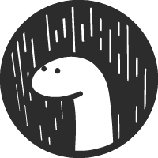
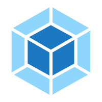

<!--  -->

Hi, my name is **LQY**.
 
I'm a front-end developer from China.
 
email: 1322760660@qq.com
 
 
🏖 前端开发者

**Languages and Tools:**

<card style="background:transparent"></card>
<card style="background:transparent"></card>
<card style="background:transparent"></card>
<card style="background:transparent"></card>
<card style="background:transparent"></card>
<card style="background:transparent"></card>
<card style="background:transparent"></card>
<card style="background:transparent"></card>

**独立开发者，有希望技术交流可以联系我 😊**

<!-- ## Status -->

<!--  -->
<!--  -->

<!-- 🏖 技术栈

- :star: Vue
- :star: React
- :star: Electron
- :star: Typescript
- :star: Nodejs
- :star: weapp
- :star: uniapp
- :star: Taro -->
